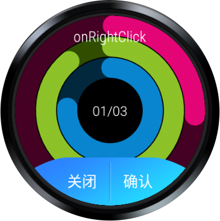

# WatchLibrary

WatchLibrary Is a tool library for watch development

# Quick Setup
#### Step 1. Add the JitPack repository to your build file

Add it in your root build.gradle at the end of repositories:
``` groovy
	allprojects {
		repositories {
			...
			maven { url 'https://jitpack.io' }
		}
	}
```

#### Step 2. Add the dependency
``` groovy
	dependencies {
		...
	        implementation 'com.github.xzp-github:WatchLibrary:v1.0.4'
	}
```

#### Step 3. Add permission

add Read and write SDcard permissions


#### Step 4. Just call WatchUtils.init(context) in your own Application:
``` groovy
public class MyOwnApplication extends Application {

    @Override
    public void onCreate() {
        super.onCreate();
        WatchUtils.init(this);
    }
    ...
}
```

## APIs

* ### Log相关  ->[Logger](./library/src/main/java/com/android/mltcode/watchlib/config/Logger.java)

  ```
  init 			:初始化
  d
  i
  e
  w
  ```

* ### 圆形CircleImageView -> [参考](https://github.com/hdodenhof/CircleImageView)

* ### 圆形RelativeLayout -> [RCRelativeLayout](./library/src/main/java/com/android/mltcode/watchlib/view/RCRelativeLayout.java)
  ```
  CircularRelativeLayout已过时
  ```
| 属性名称                      | 摘要      | 是否必须设置 | 类型      |
| ------------------------- | ------- | ------ | ------- |
| round_corner              | 总体圆角半径  | 否      | dp      |
| round_corner_top_left     | 左上角圆角半径 | 否      | dp      |
| round_corner_top_right    | 右上角圆角半径 | 否      | dp      |
| round_corner_bottom_left  | 左下角圆角半径 | 否      | dp      |
| round_corner_bottom_right | 右下角圆角半径 | 否      | dp      |
| round_as_circle           | 是否剪裁为圆形 | 否      | boolean |
| stroke_width              | 描边半径    | 否      | dp      |
| stroke_color              | 描边颜色    | 否      | color   |
| clip_background           | 剪裁背景    | 否      | boolean |

  

* ## 月牙按钮 -> [LeftRightButton](./library/src/main/java/com/android/mltcode/watchlib/view/LeftRightButton.java)

  | 属性                | 值说明                                                       |
  | ------------------- | ------------------------------------------------------------ |
  | app:leftBackground  | 左边按钮背景                                                 |
  | app:leftImgSrc      | 左边按钮图片模式下的icon , 'app:leftRightType="img"'设置有效 |
  | app:leftText        | 左边按钮文字模式下String, 'app:leftRightType="text"'设置有效 |
  | app:rightBackground | 右边按钮背景                                                 |
  | app:rightImgSrc     | 右边按钮图片模式下的icon, 'app:leftRightType="img"'设置有效  |
  | app:rightText       | 右边按钮文字模式下String, 'app:leftRightType="text"'设置有效 |
  | app:leftRightType   | 定义按钮当前使用何种模式 图片或者文字 "img" or "text"        |

  #### layout xml中使用

  ```
  <com.android.mltcode.watchlib.view.LeftRightButton
          android:id="@+id/leftrightbutton"
          android:layout_width="wrap_content"
          android:layout_height="wrap_content"
          android:layout_centerHorizontal="true"
          android:layout_alignParentBottom="true"
          app:leftBackground="@drawable/selector_cancel_bg"
          app:leftRightType="text"
          app:leftText="@string/cancel"
          app:rightText="@string/config"
          app:rightBackground="@drawable/selector_config_bg">
   </com.android.mltcode.watchlib.view.LeftRightButton>
   
  ```

  #### MainAcitvity中

  ```
   mLeftRightButton = findViewById(R.id.leftrightbutton);
   mLeftRightButton.setLeftRightListener(this);
   
   
    @Override
      public void onLeftClick(View view) {
          if(mTextView != null){
              mTextView.setText("onLeftClick");
          }
      }
  
      @Override
      public void onRightClick(View view) {
          if(mTextView != null){
              mTextView.setText("onRightClick");
          }
      }
  ```

  

  


* ## 圆环进度条 -> [CircleProgressBar](./library/src/main/java/com/android/mltcode/watchlib/view/CircleProgressBar.java)

  ```
  isAntiAlias			 		:是否抗锯齿
  getHint			     		:
  setHint 		     		:设置提示语
  getUnit 			 		:
  setUnit				 		:设置单位
  getValue			 		:
  setValue			 		：设置当前进度值
  getMaxValue			  	 	：
  setMaxValue			  	 	：设置最大进度值
  getPrecision		  	 	：
  setPrecision		  	 	：设置精度
  getGradientColors	   	 	：
  setGradientColors	   		：
  getAnimTime			   		：
  setAnimTime			   		：动画时间
  reset				   		：重置
  ```

  

  | 属性名                        | 属性值                                                       |
  | ----------------------------- | ------------------------------------------------------------ |
  | app:antiAlias                 | boolean是否抗锯齿                                            |
  | app:startAngle                | 圆弧起始角度，3点钟方向为0，顺时针递增，小于0或大于360进行取余 float |
  | app:sweepAngle                | 圆弧度数  float                                              |
  | app:animTime                  | 设置动画时间 integer                                         |
  | app:maxValue                  | 绘制内容的数值 最大值  float                                 |
  | app:value                     | 绘制内容的数值 当前值  float                                 |
  | app:precision                 | 精度，默认为0                                                |
  | app:valueSize                 |                                                              |
  | app:valueColor                |                                                              |
  | app:textOffsetPercentInRadius | 文字的偏移量。相对于圆半径而言，默认三分之一                 |
  | app:percent                   |                                                              |
  | app:hint                      | 绘制内容相应的提示语                                         |
  | app:hintSize                  |                                                              |
  | app:hintColor                 |                                                              |
  | app:unit                      | 绘制内容的单位                                               |
  | app:unitSize                  |                                                              |
  | app:unitColor                 |                                                              |
  | app:arcWidth                  | 圆弧宽度                                                     |
  | app:arcColors                 | 圆弧颜色                                                     |
  | app:bgArcColor                | 背景圆弧颜色，默认白色                                       |
  | app:bgArcWidth                | 背景圆弧宽度                                                 |

  ```
  <com.android.mltcode.watchlib.view.CircleProgressBar
          android:id="@+id/duration_cpb"
          android:layout_width="match_parent"
          android:layout_height="match_parent"
          android:layout_margin="40dp"
          app:antiAlias="true"
          app:arcColors="@array/sport_progress_colors"
          app:arcWidth="@dimen/sport_chart_arc_width"
          app:bgArcColor="@color/sport_bgArcColor"
          app:bgArcWidth="@dimen/sport_chart_arc_width" />
  ```

  
